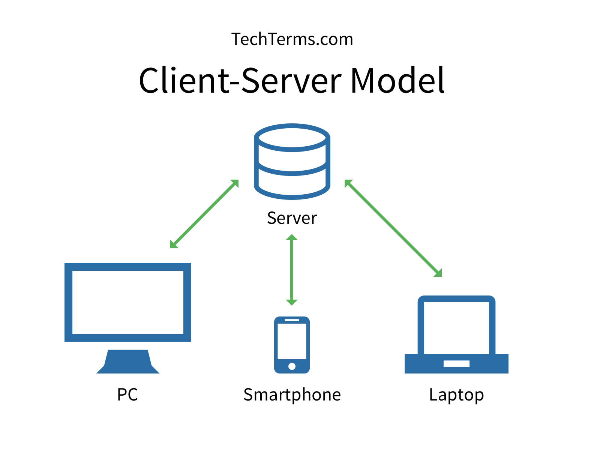

# 最简单的进程间通信

client-server mode 是互联网上使用最普遍的网络模型：



而隐藏在这个网络模型之后的底层实现就是进程之间通过 socket 进行通信，为了简化我们的描述，假设只有一个 client 和一个 server 的情形，也就是说 server 只有一个进程存在，同理 client 也只有一个进程存在，那么如何开启两个进程 client 和 server 的通信？

## 准备条件


## 进程 server


```python
# server.py
# create tcp server
s = socket.socket(socket.AF_INET, socket.SOCK_STREAM)
# enable reuse address port
s.setsockopt(socket.SOL_SOCKET, socket.SO_REUSEADDR, 1)
# bind socket to the port
server_address = ('localhost', 8000)
s.bind(server_address)
s.listen(backlog)
while 1:
    print('waitting to recevie message from client')
    client, address = s.accept()
    data = client.recv(1024)
    print(data)
```

**client**

```
# client.py
s = socket.socket(socket.AF_INET, socket.SOCK_STREAM)
server_address = ('localhost', 8000)
print 'connect to server {0}'.format(server_address)
s.connect(server_address)
s.send('data')
```

进程 server 负责监听一个 host 和 一个 port，进程 client 负责向这个 host 和 port 发起请求，server 得到 client 的请求之后，创建一个**新的 socket** 开始和 client 进行对话交流。

是的，一个新的 socket。

那 socket 究竟是什么？简单来说 socket 是一个由 (server host, server port, client host, clint port , protocol) 组成的唯一 pair。

在这个简单的模型中，server 进程通过监听端口与外界进程交流的过程是阻塞的，而且一次只能处理和一个进程的对话，处理完之后才能去处理下一个。为什么是这样的？因为只有一个进程再工作，他既需要监听新的对话，又需要处理已经建立连接的对话。有没有办法让一次能够和多个进程进行交流，当然有，其中一种办法就是多进程模型。

