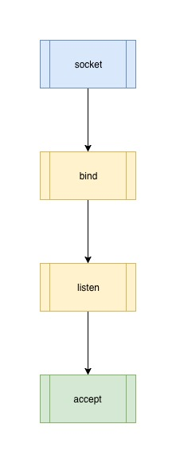
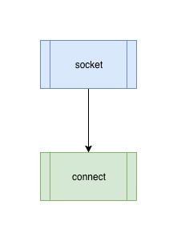

# 最简单的 Web Server 模型

Client-Server 是互联网上使用最普遍的 Web 模型：


而隐藏在这个模型之后的底层实现就是进程之间通过 socket 进行通信，为了简化我们的描述，这里我们假设只有一个 client 和一个 server 的情形，也就是说 server 只有一个进程存在，client 也只有一个进程存在，那么如何开启两个进程 client 和 server 的通信？

## Server 端的 socket

Server 端的 socket 实现过程比 client 端要复杂很多，但是一般的处理过程都可以分为如下几步：



**声明 server 的 socket 类型**

```python
s = socket.socket(socket.AF_INET, socket.SOCK_STREAM)
```

首先根据 server 的类型(TCP/UDP)声明对应的 socket，`SOCK_STREAM` 表示 TCP 协议。

**绑定到指定的 ip 和 port**

```python
server_address = ('localhost', 8000)
s.bind(server_address)
```

把声明的 socket bind 到指定的 ip 和端口，在此读者只需要知道一个 socket 是由其绑定的 ip 和 port 唯一确定的，而一个完整的 socket 通信又是由 client 的 (client_ip, client_port) 以及 server 的 (server_ip, server_port) 唯一确定的。

**进行端口侦听**

```python
s.listen()
```

告诉操作系统这个进程开始监听来自绑定 ip 和 port 的请求。

**接受 client 的请求进行处理**

```python
client, address = s.accept()
```

完整代码如下：
```python
# server.py
# create tcp server
s = socket.socket(socket.AF_INET, socket.SOCK_STREAM)
# enable reuse address port
s.setsockopt(socket.SOL_SOCKET, socket.SO_REUSEADDR, 1)
# bind socket to the port
server_address = ('localhost', 8000)
s.bind(server_address)
s.listen(backlog)
while 1:
    print('waitting to recevie message from client')
    connection, address = s.accept()
    data = connection.recv(1024)
    print(data)
```


## Client 端的 socket

Client 的 socket 比较简单，首先根据需要 socket 的类型创建 socket，然后 connect 到 server 即可：



完整代码如下：
```python
# client.py
s = socket.socket(socket.AF_INET, socket.SOCK_STREAM)
server_address = ('localhost', 8000)
print 'connect to server {0}'.format(server_address)
s.connect(server_address)
s.send('data')
```

## Server 是如何处理来自 Client 连接

在 server socket 开始 accept 之后，如果有新的 client 连接进来，accept 会返回一个新的 socket，在这里为了避免和我们之前创建的 socket 对象 `s` 产生歧义，我们称之为一个 `connection`。

**这个 connection 含义是什么？**

准确的说它是一个 server socket 和 client socket 的连接通道，由 
`(server_ip, server_port, client_ip, client_port , protocol)` 唯一标识的一个特殊的 socket，在这里 protocol 是我们在创建 socket 时使用的 socket 类型，在上文的代码中用 `socket.SOCK_STREAM` 表示，意思是 TCP 协议类型的 socket。

通过这个 connection，client 和 server 就能相互通信和传输数据，这就是最简单的进程间的通信。

## 这个最简单的模型有什么问题

在上文的模型中，server 进程通过监听端口与外界 client 进程交流的过程是阻塞的，而且一次只能处理和一个 client 的对话，处理完之后才能去处理下一个，也就是它的并发处理能力是 1，只要有一个 client 和它建立了 connection，其它的 client 就需要等待。

为什么是这样的？因为只有一个进程在工作，它既需要监听新的 connection ，又需要处理已经建立连接的 connection 。那如何提高它的并发处理能力呢，也就是有没有办法让 server 能够和多个 client 进行交流，当然有，其中一种办法就是多进程 Web Server 模型。

