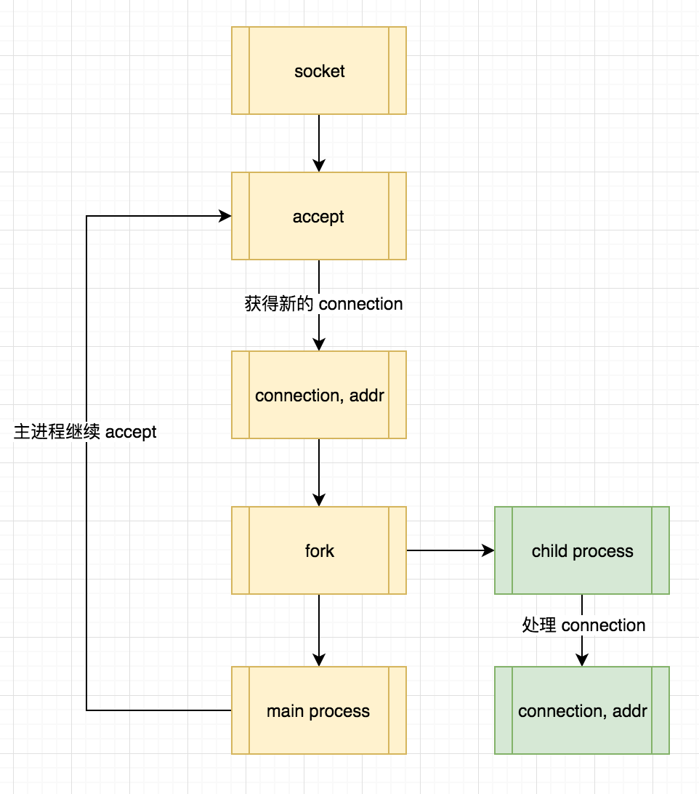
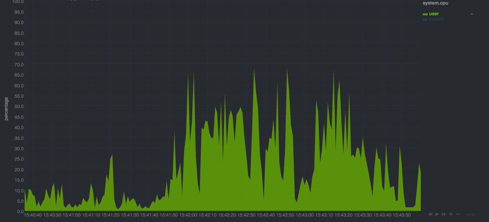

# 多进程模型

多进程模型是为了解决单个进程既要执行监听工作，又要执行新 socket 的数据传输工作，一人分饰两个角色的低效而诞生的。

## 多进程是如何工作的？

每当有新的 connection 进来，侦听进程在获得 connection 之后 fork 一个新进程来处理这个新的 connection，原有的进程就不必等待处理工作完成之后再去继续监听，而是在 fork 完成之后就可以，这样**监听和处理就分开了，各司其职**。

<!--  -->


在 linux 中，fork 出来的进程和父进程拥有同样的上下文信息、内存数据、与进程关联的文件描述符等，这里的文件描述符中就包含新来的 socket ，不同的是这两个进程完全是在两个不同的虚拟内存段上，相互不干扰。


```python
# create tcp socket
s = socket.socket(socket.AF_INET, socket.SOCK_STREAM)
# enable reuse address port
s.setsockopt(socket.SOL_SOCKET, socket.SO_REUSEADDR, 1)
# bind socket to the port
server_address = ('localhost', 8000)
s.bind(server_address)
s.listen(10)
while 1:
    print_green(' waitting to recevie message from client')
    connection, address = s.accept()
    if not os.fork():   # enter child process
        time.sleep(1)   # exec task in 3 seconds
        msg = connection.recv(1024)
        print_red("child process")
        connection.send(msg.capitalize())
        connection.close()      # close client socket
        s.close()       # child does not need this
        break           # break child while loop
    connection.close()      # parent does not need this
```

在多进程模型中，子进程是拥有与父进程完全一样的上下文信息，由于子进程只是个工作进程用来处理新的 socket 连接，所以子进程中 copy 过来的监听 socket 需要释放，而且子进程在处理完毕新的 connection 之后也需要释放自身占用的资源，即退出子进程。

通过简单的多进程模型，处理工作和监听请求就分开了，这样 server 进程可以同时处理多个对话了，也就是我们常说的**支持并发，而并发就是同时可以处理多个事情**。

多进程模型可以说是最简单的并发模型，在现实的应用当中也有不少开源库采用这种模式，比如 Python 中著名的异步任务队列 [RQ](http://python-rq.org/) ，其工作原理就是对每个需要执行的任务 fork 新的进程来处理。

## 多进程的问题

多进程能够解决单进程模型中不能并发的问题，而且实现简单直观，同样多进程也有其自身的缺点。

### 数据共享复杂

在真实的 web server 中，经常需要工作单元和监听单元进行数据共享，比如 web server 的某些全局状态(访问量统计，session 的修改，白名单黑名单的设置等)可能会因为部分请求而改变，如果 web server 是多进程模型，此时这个共享的全局状态就应该及时周知 web server 中的正在处理新 connection 的所有子进程，在多进程模型中处理类似的问题就需要**进程间的通信**。

进程间通信有多种方式，常见的有：信号、共享内存，还有我们现在正在讨论的 socket。

**信号**

信号是 linux 中两个进程进行通信的一种重要手段，但是相比在 web server 中需要交流沟通的两个进程来说，由于 linux 中的信号是由一组有限的信号函数组成，信号能够表达和发送的数据信息都非常简单，无法满足 web server 中复杂的数据共享需求。

**共享内存**

共享内存，是指两个进程共享一段物理内存，相比信号，共享内存能够提供更复杂的数据交换方式；但是共享内存却有一个无法忽视的缺点：共享数据的访问的安全性必须由开发者来保证，因为**它没有一个很好的同步机制来保证同一段内存信息被多个进程访问时的读写安全**。

**socket**

现在假设，工作进程和监听进程是通过 socket 来共享上数据的，也就是说监听进程获取的新的 socket 可能是来自一个自身 fork 出来的子进程，目的是为了告诉它一些共享数据的变化。为了能够区分新到的 socket 是来自子进程还是别的正常的网络请求，监听进程必须要做一些额外的工作，比如正确解析来自子进程的协议，为了能够及时通知其他正在工作的子进程，监听进程又需要保留所有工作子进程的相关信息在数据发生改变时通知它们。是不是已经感受到了这种方式的复杂，其实到这步我们需要处理的工作还远未结束，子进程还需要和父进程的保持连接并且保证能随时收到来自父进程的通知等等等...

socket 的模式真的很复杂，是不是，使用 socket 模式就像 web server 中本身又需要一个 web server 来接管和子进程的通信，现实中这部分需求往往我们会借助第三方工具来实现，比如 MQ。

### 能够支持的并发非常有限

进程模型除了带来进程间通信交流的复杂问题，并发量大时还会占用大量操作系统资源。在 linux 中每多一个进程处理，计算机就要分配相应的资源对进程进行管理，比如进程的上下文切换，进程的唤醒和中断等，僵死进程的处理等诸如此类的问题。

试着把你的 chrome 浏览器标签页开到几十个感受一下多进程带来的直接影响。



图中是进程模式 web server 下 4 个 client，每个请求间隔 3s 发起，持续约 1 分钟左右的请求导致的 server 端 CPU 利用率曲线。

多进程模型已经能够简单的支持并发了，却又引入其他更复杂的问题，那还有更好的机制么？当然有，那就是我们接下来要说的多线程模型 web server。