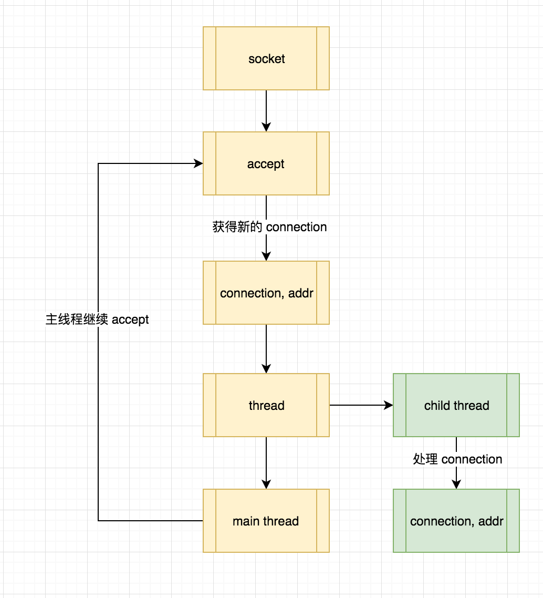

# 多线程模型

多进程模型 web server 带来一个难题：进程间的数据共享，而多线程 web server 处理这个问题显然更得心应手，因为**同一个进程的多个线程是共享上下文的**。

要想把这个问题说清楚，我们首先说说线程是什么以及它的特点。

## 线程

线程是是操作系统的一个调度单元，线程包含在进程之中。一个进程最少有一个线程，叫主线程，也就是运行中的进程。一个进程中可以有多个线程，线程之间共享进程的全部系统资源，比如程序数据、文件描述符等等。线程可以挂起、中断、结束，也就是操作系统可以通过这些状态来对进程中的多个线程进行调度，比如某个线程有 IO 等待时就可以暂时被挂起，让出 CPU 让其他线程执行。

正式基于线程有这样的特点，多线程的 web server 共享数据比多进程的更容易实现，而且效率更高。

```python

def process_client_request(client):
    time.sleep(1)   # exec task in 3 seconds
    msg = client.recv(1024)
    print_red("thread %s" % threading.current_thread().name)
    client.send(msg.capitalize())
    client.close()      # close client socket


def main():
    # create tcp socket
    s = socket.socket(socket.AF_INET, socket.SOCK_STREAM)
    # enable reuse address port
    s.setsockopt(socket.SOL_SOCKET, socket.SO_REUSEADDR, 1)
    # bind socket to the port
    server_address = ('localhost', 8000)
    s.bind(server_address)
    s.listen(10)
    while 1:
        print_green(
            str(datetime.now()) + ' waitting to recevie message from client')
        client, address = s.accept()
        t = threading.Thread(target=process_client_request, args=(client,))
        t.daemon = True
        t.start()
```



可以看出在线程中很容易获得进程的所有状态信息以及数据，但是既然是每个线程都可以很方便的获取进程的数据，势必就存在多线程同时读写同一数据的情况，这就又引入一个问题：共享资源的读写安全，也就是我们经常说的线程安全 thread-safe。

## 什么是线程安全？

如果一段代码或共享数据在多线程之下运行，并且总是能保证运行结果是正确的，它就是线程安全的，换句话说就是必须保证在任意时刻只有一个线程对内存的同一快区域进行操作。

如何保证线程安全？方法当然是有的，是不是每一种都适合用于多线程模型的 web server 中呢，我们一一来讲。

**第一种，不对全局共享数据做修改操作**

如果你不做任何保护措施，不要在多线程场景中对全局共享数据做修改操作。这样当然能保证是线程安全的，但这显然不是我们的 web server 中需要的，因为我们的目的就是要做数据共享并且就是要修改全局数据。

**第二种，线程本地数据 thread local storage**

顾名思义，thread local storage 是指把数据当成当前线程自身数据的一部分，对于其它线程来说是一个私有变量，只有创建数据的线程能够进行读写。这种方式之下，多个线程之间无法共享彼此的 local storage，这不是我们希望的 web server 所看到的。

**第三种，互斥锁 mutual exclusion lock**

互斥锁就是使用某种机制来保证在任意时刻证共享资源被访问时只能有一个线程，互斥锁的使用必须要非常小心，因为使用不当可能会导致死锁、线程饥饿等现象。可见互斥锁是提供了一种保护机制，但是各个线程之间还是可以共享数据的，只是需要对这部分数据做好保护即可，好像可以用解决我们遇到的问题哦。

**第四种，原子操作**

原子操作是指正在执行的线程的操作不会被其它线程中断，之所以是原子就是因为这样的操作是最小的执行单元了，已经无法在分割。原子操作必须在系统层面做支持，而我们 web server 中对数据的共享操作几乎都是发生在用户进程中，而且根据场景的不同操作方式也是各一，能够使用原子操作的地方还要视具体场景而定，限制较多。

综上，使用互斥锁是对共享数据进行加锁保护是一种可行的机制，因而可以再多线程 web server 中采用。

修改上面的例子

```python

lock = threading.Lock()
GLOBAL_REQUEST_STATE = {
    'count': 0
}


def process_client_request(client):
    time.sleep(1)   # exec task in 3 seconds
    msg = client.recv(1024)
    print("thread %s" % threading.current_thread().name)
    client.send(msg.capitalize())
    client.close()      # close client socket
    with lock:
        GLOBAL_REQUEST_STATE['count'] += 1


def main():
    # create tcp socket
    s = socket.socket(socket.AF_INET, socket.SOCK_STREAM)
    # enable reuse address port
    s.setsockopt(socket.SOL_SOCKET, socket.SO_REUSEADDR, 1)
    # bind socket to the port
    server_address = ('localhost', 8000)
    s.bind(server_address)
    s.listen(10)
    while 1:
        print(
            str(datetime.now()) + ' waitting to recevie message from client')
        client, address = s.accept()
        t = threading.Thread(target=process_client_request, args=(client,))
        t.daemon = True
        t.start()

```

`global_request_state` 全局变量，每一个 request thread 都会修改，因而用锁进行保护。

加锁保护是多线程模型中必要的数据保护机制，不仅仅用在多线程的 web server 中，只要在多线程模型中存在多个线程对同一个内存区域进行读写就需要锁的保护。

## 多线程的问题

多线程的为 web server 提供了请求线程资源共享的能力，那我们的 web server 模型是不是就没有缺点了？并不是。

到目前为止，我们所用的 socket 都是阻塞式 blocking 的，也就是无论是 accept 还是 send、recv都会导致当前工作进程或线程由于消息没有及时发出或到达而处于等待状态，这样的场景在多并发之下更是非常普遍。

我们一起来设想一下。

在多线程 web server 中，某个工作线程处理的 socket 由于某种原因消息没有送达，暂且叫它 B 线程，调用 recv 时发生阻塞，由于线程的调度是操作系统控制的，此时 B 线程由于不再占用 CPU 而被操作系统挂起，让出 CPU 的控制权给其它工作线程使用，某一刻 B 线程等待的 socket 数据到达了可以读取了，**但是 B 线程何时才能获得 CPU 的使用权从而读取数据？答案是不知道**。因为线程的调度完全是随机的，任由操作系统根据每个线程占用时间片和线程当前的状态进行调度，也就是 B 线程完成数据的读取的时机是不确定的。在真实的 web server 工作环境中，类似 B 线程的这种线程是大量存在的。那么我们该如何准确的准确无误的唤醒等待中的线程告诉它等待的 socket 可写可读了，让它们赶紧干活呢？

答案就是 io 多路复用技术 -- IO multiplex，我们下一篇会细细道来。