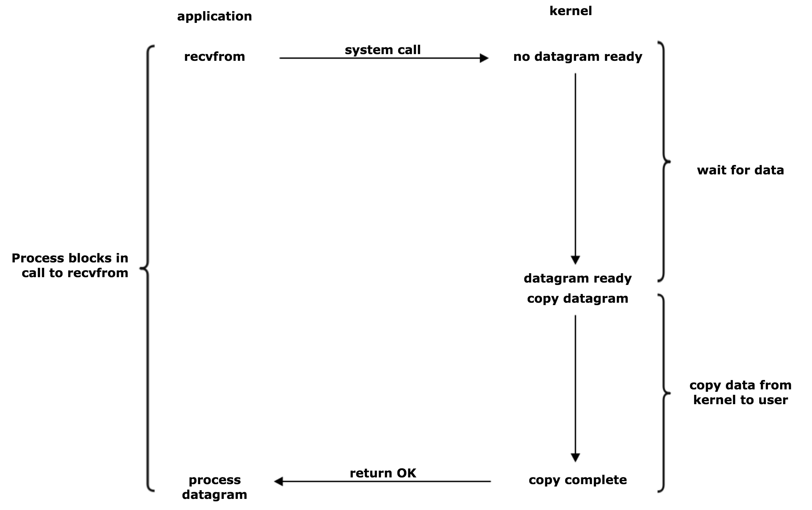
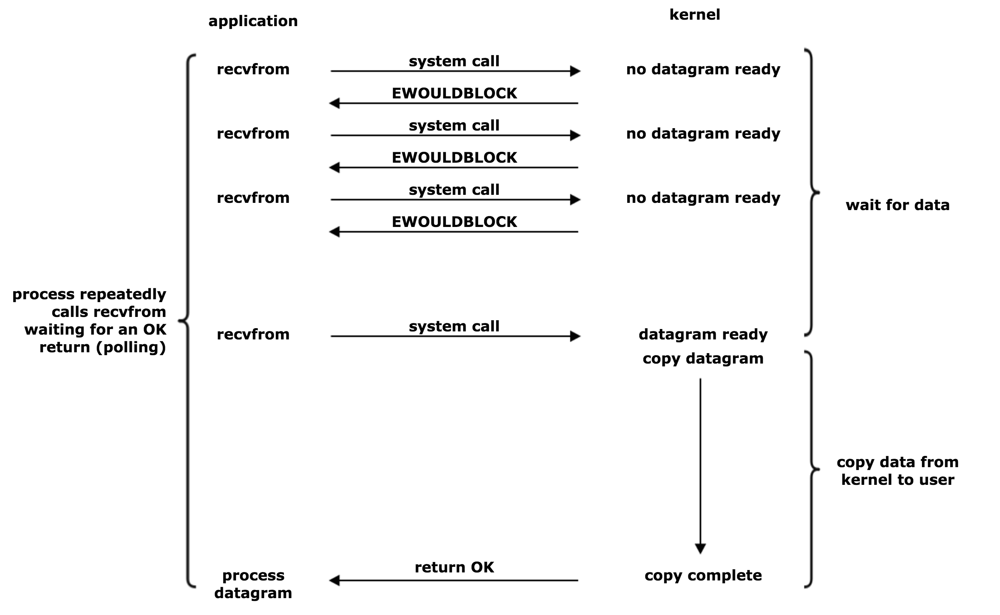
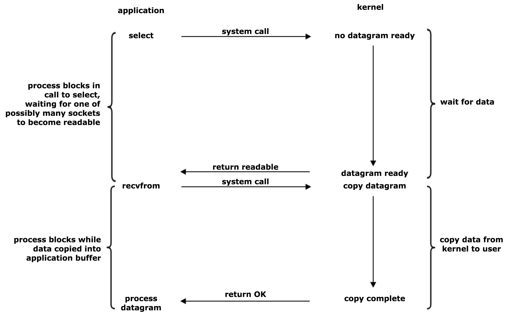
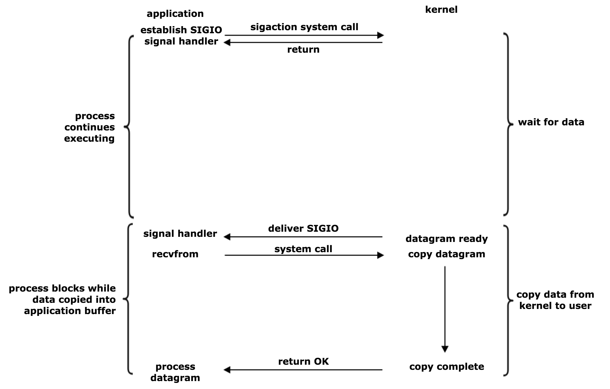
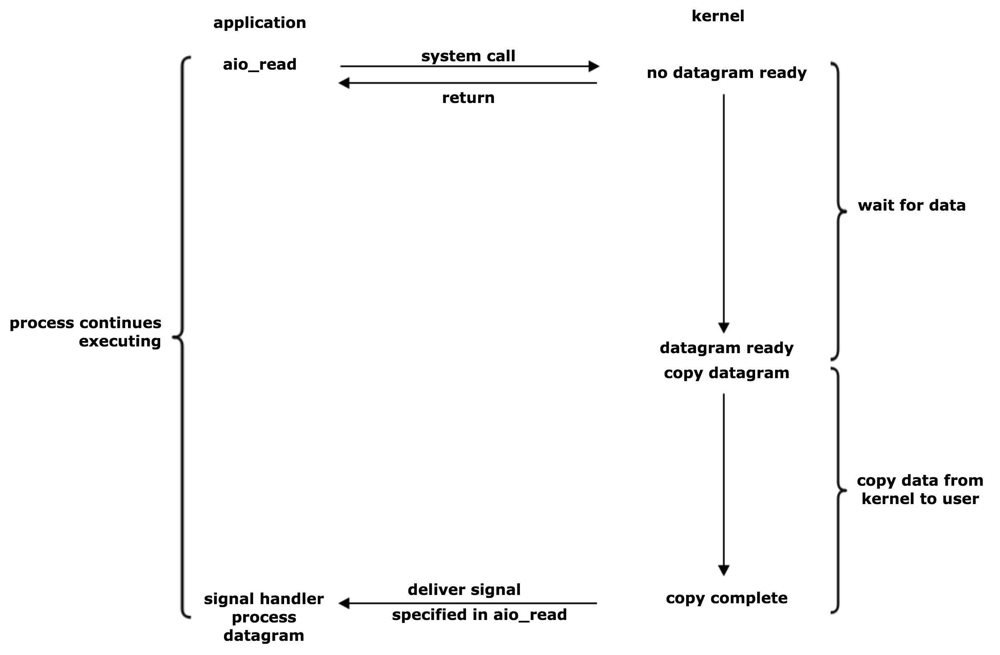

# IO 多路复用技术

## 为什么需要 IO 多路复用技术？

在多线程 web server 模型下由于线程的调度切换完全是由操作系统控制的，如果 socket 在某一时刻不可读或不可写导致调用阻塞引起线程被挂起，而 socket 何时可读何时可写都只能随机等待线程重新获取被调用的机会只会才能知道，还有一种做法就是设手动不断的检查来查看 socket 是否可读可写，然后再调用相应的工作线程进行处理，无论是哪种方式都将引入额外的开销，而且代码将变得非常复杂而且难以维护。

## 什么是 IO 多路复用技术？

在非 IO 多路复用技术的模型中，我们怎么得知有新的 socket 连接或者 socket 已经准备好读或写，只能是一直苦苦等待或者不断做轮询检查，而在 IO 多路复用技术可以做到主动通知。

在 IO 多路复用技术中，通过告知内核需要监听的 socket 以及对应的事件，由内核通知我们 socket 是否已经准备就绪，而不是不断的检查或做无用功。也就是说 IO 多路复用技术是内核提供的一种功能，由于是被动通知，IO 多路复用技术又称事件驱动。

IO multiplex 多用在是网络编程中，常常用来解决一下问题：
- A Client 同时处理多个文件描述符
- A Client 同时处理多个 sockets
- A TCP Server 同时处理监听 socket 以及已经连接的 socket
- A Server 同时处理 UDP 和 TCP
- A Server 同时处理多种服务和多种协议

## IO 多路复用技术用到的基础概念

**阻塞**是指调用需要等待结果的完成，调用会影响后续指令的进行，可以认为计算机的任何调用都是阻塞的，因为不管什么调用都有 CPU 的执行等待，所以阻塞是一个相对概念，只有在限定场景之下讨论阻塞才更有意义，比如一个请求涉及 5 个函数调用，请求的平均响应时间是 20 ms，分布到每个函数是 4 ms，如果某个函数调用时需要等待的时间导致请求的平均响应时间变长了，我们说这个函数是一个阻塞操作。

**非阻塞**，调用方式不影响后续的指令执行，即函数执行之后立即返回，不等待结果的响应。

**同步**是指调用方需要等待结果的返回，然后才执行后续指令，不管等待时间的长短，同步必然阻塞。

**异步**是指调用方不需要等待结果的返回，结果以通知的形式获得，真正的异步是需要在程序执行的每一步执行都需异步操作，比如 nodejs 中的 callback 通知。

## IO 模型

IO 多路复用技术会涉及到以下几种 IO 模型的讨论，他们分别是：

- blocking I/O
- nonblocking I/O
- I/O multiplexing (select and poll)
- signal driven I/O (SIGIO)
- asynchronous I/O (the POSIX aIO_ functIOns)

所有的 IO 模型都会涉及以下两个基本的执行流程：
1.等待数据可用，这通常是指等待网络中的数据包到达，到达之后内核把会把数据包 copy 到 内核 buffer。
2.从内核 copy 数据到处理进程，这是指把数据从内核拷贝到用户进程。

**阻塞 IO** 是指程序在遇到 IO 调用时一直等待 IO 就绪才会执行相应的指令，我们在前几章讨论的单进程模型，多线程模型都属于 recv 数据都属于阻塞 IO，同步阻塞是最最简单的模型，socket 默认是阻塞的。

**非阻塞 IO**，是指遇到 IO 调用时不管 IO 有没有准备就绪（内核把数据拷贝到进程）都直接返回

**IO multiplex** 是借助 select 和 poll 等内核提供的机制只在 IO 准备就绪内核通知我们以后才进行 IO 操作。

**信号驱动 IO**，同 IO 多路复用技术，内核通过信号通知我们的 IO 何时就绪。

**Asynchronous IO**，同信号驱动 IO，内核通过信号通知我们的 IO 何时就绪，区别在于信号驱动 IO 通知发生在数据开始拷贝时，而异步 IO 通知在数据已经完成从内核到用户进程的拷贝。