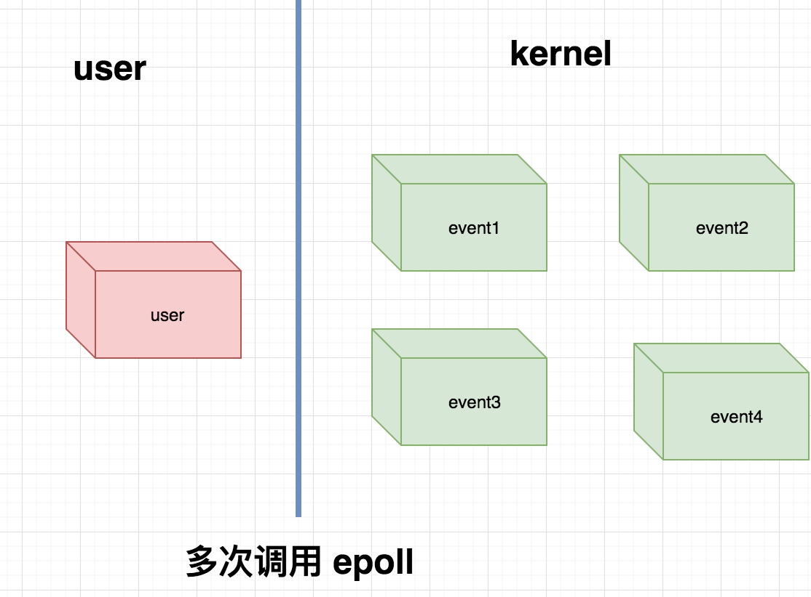

# epoll 之水平触发和边缘触发

epoll 有两种执行模式，一种是水平触发（level-triggered），一种是边缘触发（edge-triggered），默认是水平触发。

## level-triggered

level-triggered 意思是如果一个文件描述符就绪了，也就是有事件准备读或准备写，调用 epoll 之后内核会把这个文件描述符从内核拷贝到用户空间，并通知用户对应的事件，如果用户此时选择不处理该描述符的事件，即用户不进行数据读或不进行数据写，下次调用 epoll 时，内核依然会返回这个事件。


不论 epoll 调用多少次，只要事件 event1 就绪，内核总是会把事件描述符返回给用户。

## edge-triggered

edge-triggered 意思是如何一个文件描述符就绪了，也就是有事件准备读或准备写，调用 epoll 之后内核会把这个文件描述符从内核拷贝到用户空间，并通知用户对应的事件，如果用户选择不处理该描述符的事件，即用户不进行数据读或不进行数据写，下次调用 epoll 时，内核不会再返回这个事件，除非把对应的事件重新激活，内核才会在下次调用中返回该事件。



第二次调用 epoll 不会返回已经返回过的事件 event1。

## 差异

level-triggered 描述的是一种状态，一种存在 present，即事件发生了这一种状态，只要这个状态一直存在，内核就会一直不断的处理，也就是同一个事件可能会被内核反复拷贝。

edge-triggered 描述的是一个事件，一个发生的事件 event，即事件从无到有这一状态的改变，也就是发生了这件事，此时内核才会拷贝这个事件，如果用户没有处理，接下来内核不会再次进行拷贝，即使这个事件在内核中存在，但是这个事件已经发生过了。

level-triggered 模式是尽可能的让事件被用户应用程序感知到，而 edge-triggered 可能的问题是也许会会让用户应用程序错过某些事件，因为它只在事件发生的那一刻才会通知用户。

edge-triggered 更高效，但是 level-triggered 更安全。

## edge-triggered 的使用

epoll 默认是 level-triggered，如果需要使用 edge-triggered 需要更改注册事件类型以及处理事件的方式。

首先需求修改注册事件类型：
```python

poller.register(server.fileno(), READ_ONLY | select.EPOLLET)
```

其次在需要处理事件时我们必须一次性全部处理完成，accept 处理：
```python
try:
    while True:
        connection, client_address = s.accept()
        connection.setblocking(0)
        fd_to_socket[connection.fileno()] = connection
        poller.register(connection.fileno(), READ_ONLY)

        # Give the connection a queue for data we want to send
        message_queues[connection] = Queue.Queue()
        print_red(' connection {0} is comming ==> '.format(
            connection.getpeername()))
    pass
except socket.error:
    pass
```

读取数据：
```python
data = ''
try:
    while True:
        _data = s.recv(1024)
        if not _data:
            break
        data += _data
except socket.error:
    pass

```

发送数据：
```python
try:
    while next_msg:
        bytelength = s.send(next_msg)
        next_msg = next_msg[bytelength:]
except socket.error:
    pass
```

## select 、poll、epoll 该如何选择

这个话题我们将在下节介绍