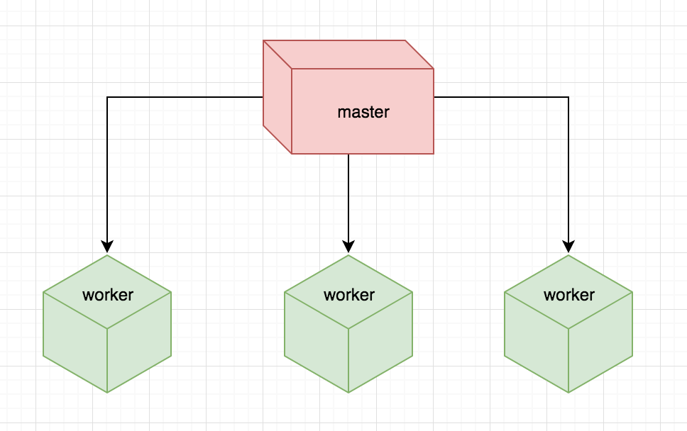

# Nginx

Nginx 是什么以及 nginx 能够做什么不是本文讨论的重点，本文的重点是 nginx 使用的 web server 模型，即本系列的主题。

## Master-worker 模型

Nginx 采用的是 master-worker 模型：

master 进程在启动 nginx 时第一个创建的进程，一般以超级权限建立，master 主要负责：

- 读取和校验配置
- 创建、绑定和关闭 socket
- 创建、终止、维护 worker 进程
- 无中断情况下重新更新配置
- 重新开启日志文件
- 等等

worker 进程主要负责：

- connection 的 accept 和 process 
- 反向代理
- 请求过滤
- 等等 nginx 支持的常规功能

也就是说 master 进程在启动时会创建和绑定到指定的 socket，然后 master 进程根据配置(默认选择各个平台最高效的网络 IO 模型，linux 是 epoll) fork 出指定数量的 worker 进程，worker 进程负责通过 master 进程绑定的 socket 进行 accept 和 process 来自 client 的 connection，各个 worker 进程间通过共享内存的方式进行通信，虽然各个 worker 都可以进行 connection 的 accept 但是 nginx 通过文件锁以及各个 worker 进程当前处理 connection 的数量进行评估仅仅选择一个 worker 进程进程新 connection 的 accept。

Nginx 的 worker 进程是默认单线程的，也就是 worker 进程是**单进程模型+IO 多路复用技术**，各个 worker 进程又组成了 **多进程模型+IO 多路复用技术**，不过任意时刻，只有一个 worker 进程能够 accept 新的 connection。

Nginx 的这种 master-worker 的模型能够充分发挥现代 CPU 多核的能力，下图来自网络的 nginx 架构图：

## Nginx 的高性能

Nginx 在 web server 领域的地位是久经考验的，这得益于它的使用简单、性能强劲，nginx 为什么达到如此高的性能标准，结合本系列介绍的各个主题我们一起来分析一下。

**C 语言**

Nginx 是 C 语言编写的，由于 C 语言是最接近系统的底层的高级语言，C 语言的性能几乎是所有高级语言中最好的。

**单进程模型**

不同于传统的多进程以及多线程 web server，nginx 中一个 connection 从 accept 到 process 都是在一个进程的一个线程中完成，完全不需要进行进程或线程的上下文切换，也不需要锁的开销，这就最大程度上保证了单个进程几乎能够跑满单核 CPU（可以在 nginx 配置中指定 worker 进程绑定到具体的 CPU），最大程度上减少对 CPU 时钟的浪费。

**各个平台的高效事件模型**

Nginx 会选择各个平台最高效的网络模型来实现对网络事件的充分利用，比如 linux 下默认是 epoll，macOS 的 kqueue。

**持续的优化**

Nginx 从发布第一版到现在已经过去 10 多年了，在社区以及 nginx 官方的不断努力之下，nginx 持续不断地改进，包括内存分配、锁的利用、尽量少的系统调用等等技术的优化，使得 nginx 越来越高效，特性越来越丰富。
